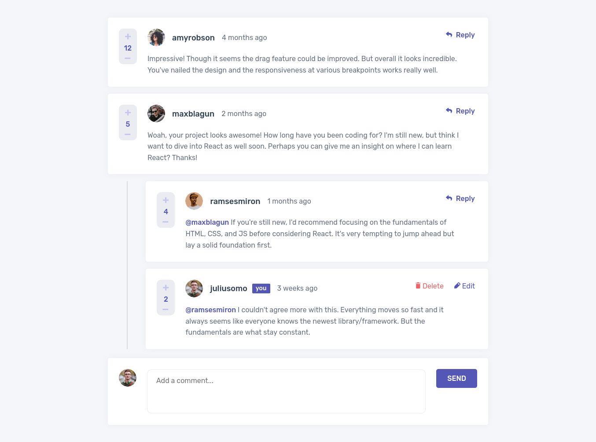

# Frontend Mentor - Interactive comments section solution

This is a solution to the [Interactive comments section challenge on Frontend Mentor](https://www.frontendmentor.io/challenges/interactive-comments-section-iG1RugEG9). Frontend Mentor challenges help you improve your coding skills by building realistic projects. 

## Table of contents

- [Overview](#overview)
  - [The challenge](#the-challenge)
  - [Screenshot](#screenshot)
  - [Links](#links)
- [My process](#my-process)
  - [Built with](#built-with)
  - [What I learned](#what-i-learned)
- [Author](#author)

## Overview

### The challenge

Users should be able to:

- View the optimal layout for the app depending on their device's screen size
- See hover states for all interactive elements on the page
- Create, Read, Update, and Delete comments and replies
- Upvote and downvote comments
- **Bonus**: If you're building a purely front-end project, use `localStorage` to save the current state in the browser that persists when the browser is refreshed.
- **Bonus**: Instead of using the `createdAt` strings from the `data.json` file, try using timestamps and dynamically track the time since the comment or reply was posted.

### Screenshot

### Links

- Solution URL: (https://github.com/exxnnonymous/interactive-comment-section)
- Live Site URL: (https://exxnnonymous.github.io/interactive-comment-section/)

## My process

### Built with

- Semantic HTML5 markup
- CSS custom properties
- Flexbox
- CSS Grid
- Mobile-first workflow
- Vanilla JavaScript

### What I learned

This could be made very easily with react but i used vanilla javascript to practice more and develop my problem solving skill. This was complecated but i finally did it. I learned a lot.

## Author

- Frontend Mentor - [@exxnnonymous](https://www.frontendmentor.io/profile/exxnnonymous)
- Twitter - [@exxnnonymous](https://www.twitter.com/exxnnonymous)

**Note: Delete this note and add/remove/edit lines above based on what links you'd like to share.**
